# Per-Device Encryption Keys - LoRaRAW

**Audience:** production and commissioning engineers.
**Purpose:** give every LoRa device its own AES key instead of the one key shared
by the whole fleet, and know how to verify it actually took.

Everything here works with `module-core-loraraw` as shipped. No firmware or
module change is required.

---

## Table of contents

1. [Why this matters](#1-why-this-matters)
2. [How AES protects a LoRa packet](#2-how-aes-protects-a-lora-packet)
   - [2.4 Worked example: one real frame, end to end](#24-worked-example-one-real-frame-end-to-end)
3. [How Rubix CE picks the key](#3-how-rubix-ce-picks-the-key)
4. [Key format - the one thing people get wrong](#4-key-format---the-one-thing-people-get-wrong)
5. [Generating a key](#5-generating-a-key)
   - [5.1 The whole procedure at a glance](#51-the-whole-procedure-at-a-glance)
6. [Loading a key: Optical Power Meter](#6-loading-a-key-optical-power-meter-stm32)
7. [Loading a key: Droplet V2](#7-loading-a-key-droplet-v2-stm32)
8. [Loading a key: FGA Gen2](#8-loading-a-key-fga-gen2-esp32)
9. [Entering the key in Rubix CE](#9-entering-the-key-in-rubix-ce)
10. [Verifying it worked](#10-verifying-it-worked)
11. [Troubleshooting](#11-troubleshooting)
12. [Production checklist](#12-production-checklist)
13. [Known limitations](#13-known-limitations)

---

## 1. Why this matters

Every device that has never been re-keyed ships with the **same** AES key. That
key is a compile-time constant in the firmware source, so anyone who reads the
source, or who extracts the key from a single device, can decrypt and forge
traffic for **every** device in the field.

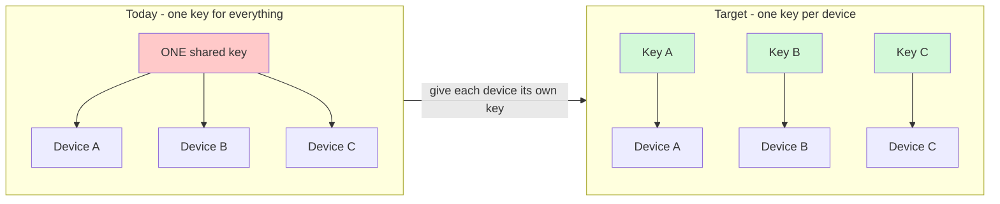

With per-device keys, extracting one device's key exposes that device only.

**The job is two steps, and both must be done:**

1. Load a unique key into the device.
2. Enter the same key into Rubix CE, in that device's **Device Key** field.

Miss either step and the device goes silent, because the two ends no longer
agree on the key.

### What you need at the bench

| Device | Hardware | Power |
|---|---|---|
| Optical Power Meter (STM32) | ST-LINK V3 + UART adapter, both broken out by an **ICQMCU module** | **3.3 V supply** - required to enter AT mode |
| Droplet V2 (STM32) | same as above | **3.3 V supply** - required to enter AT mode |
| FGA Gen2 (ESP32) | plain USB cable | battery or USB, either works |

Plus a terminal at **115200 baud, 8N1** on the UART/USB serial port.

The ICQMCU module matters on the STM32 boards because you need SWD and UART at
the same time: flash or verify over SWD, talk AT over UART, without unplugging
anything in between.

---

## 2. How AES protects a LoRa packet

### 2.1 What a frame looks like on air

The outer frame - what the gateway hands to Rubix CE:

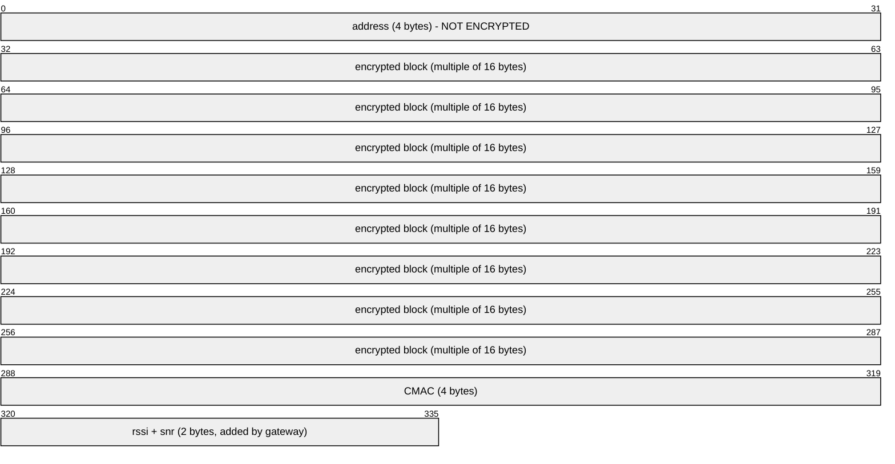

Inside the encrypted block, once decrypted:

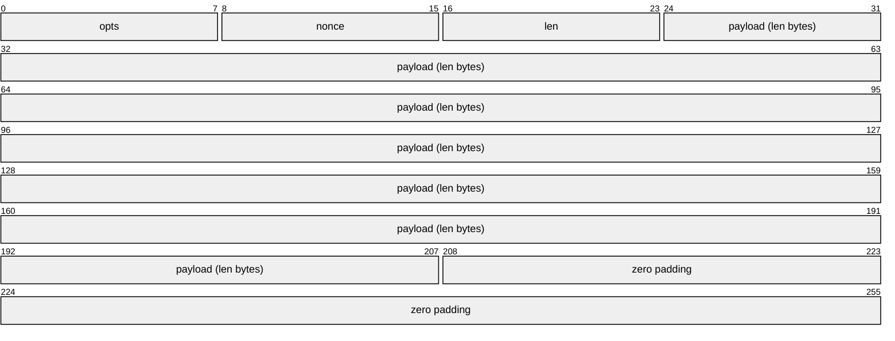

| Part | Size | What it is |
|---|---|---|
| address | 4 bytes | Device identity. On LoRaRAW devices the **second byte is always `C0`** - see 2.1.1. The other three come from the chip's unique ID or MAC |
| opts | 1 byte | Frame type: 0 uplink, 1 confirmed uplink, 2 ack, 3 request, 4 response |
| nonce | 1 byte | Message counter, used to match a reply to a request |
| len | 1 byte | Length of the real payload, so padding can be removed |
| payload | len bytes | The sensor data |
| padding | 0-15 bytes | Zeros, to reach a whole 16-byte AES block |
| CMAC | 4 bytes | Tamper check computed over address + encrypted part |
| rssi, snr | 2 bytes | Signal quality, added by the gateway radio board |

### 2.1.1 Why every address has `C0` in it

Take the address from the worked example below:

```text
  5C   C0   D9   47
   |    |    |    |
   |    |    |    +-- from the chip's unique ID
   |    |    +------- from the chip's unique ID
   |    +------------ ALWAYS C0 - the protocol version marker
   +----------------- from the chip's unique ID
```

The second byte is **not** part of the device identity. It is a fixed protocol
version marker that every firmware writes into the same position:

- `module-core-loraraw`: `LORARAW_VERSION = 0xC0`, `LORARAW_VERSION_POSITION = 1`
  (positions counted from 0, so position 1 is the second byte)
- Optical Power Meter and Droplet V2: `(VERSION << 16)` in `GenerateMAC4()`
- FGA Gen2: `addr[1] = 0xC0` in `generateAddressUnique()`

Two practical consequences:

1. **Every LoRaRAW device has `C0` as its second byte** - Optical Power Meter,
   Droplet V2 and FGA Gen2 all do. If one of those does not, suspect a typo.
2. **Only 3 bytes carry identity**, not 4. That is 16.7 million combinations
   rather than 4.3 billion. Still far more than any single site needs, but worth
   knowing when you assign or audit addresses.

**One exception you will meet in the field.** Older MicroEdge units predate this
convention and use a different address scheme, so their addresses do *not* carry
`C0`. A real example from a live site:

```text
5CC0D947   Optical Power Meter   second byte C0 - LoRaRAW
C3C0A660   FGA Gen2              second byte C0 - LoRaRAW
79ACDB45   MicroEdge V1          second byte AC - legacy, not LoRaRAW
```

Legacy MicroEdge devices are outside the scope of this guide: they encrypt the
whole frame including the address, so Rubix CE cannot read the address before
decrypting and **cannot give them a per-device key at all**. They stay on the
shared key until the hardware is replaced.

> Careful with the wording "byte 1": the Go module counts from 0, the STM32
> firmware comments count from 1, and they mean the same byte. This document
> says **"the second byte"** to avoid the ambiguity.

### 2.2 The important detail

**The address is not encrypted.** It has to stay readable, because the receiver
must know *which* device sent the frame before it can choose *which key* to try.

That is exactly what makes per-device keys possible without changing the radio
protocol at all.

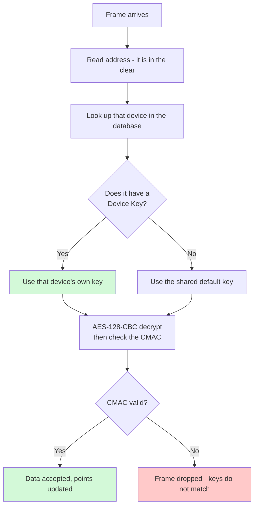

### 2.3 Encrypting and decrypting, step by step

**Device sending:**

1. Build the inner block: `opts | nonce | len | payload`
2. Pad with zeros up to a multiple of 16 bytes
3. Encrypt that block with AES-128-CBC using the device's key
4. Compute a CMAC over `address + encrypted block`, keep the first 4 bytes
5. Transmit `address + encrypted block + CMAC`

**Rubix CE receiving:**

1. Strip the 2 trailing rssi/snr bytes added by the gateway
2. Read the 4-byte address, look up the device, fetch its key
3. Recompute the CMAC and compare with the received 4 bytes
4. If it matches, decrypt and use `len` to strip the padding
5. If it does not match, drop the frame

The CMAC is what tells CE "this key is correct". A wrong key fails the CMAC
check, so a bad key never produces garbage data - it produces no data at all.

### 2.4 Worked example: one real frame, end to end

This section follows a single genuine frame from device `5CC0D947` all the way
through: how the device builds it, what goes on air, and how Rubix CE takes it
apart again. Every value below is copied from a real bench run.

#### Part A - the device builds and sends the frame

**A1. Collect the readings.** The Optical Power Meter firmware packs four
datapoints, each at a fixed position:

| Position | Value | What it is | Source |
|---|---|---|---|
| UVP-1 | 60 | transmit interval, seconds | `RAM_Config.tdc_s` |
| UVP-2 | 3.7 | battery voltage | ADC reading |
| UVP-3 | 0 | packet counter | `packet_id_counter` |
| UVP-6 | 0 | optical pulse count | LPTIM counter |

**A2. Bit-pack them into a payload.** The Rubix encoder writes a one-byte
position header before each value, then the value itself in a fixed-point or
raw form. The result here is 23 bytes:

```text
01A08000F284C968A200000000A5900000000000000000
```

**A3. Add the inner header.** Three bytes go in front: frame type, message
counter, payload length.

```text
01    opts  = confirmed uplink
21    nonce = 33 (this device's 33rd message since boot)
17    len   = 23 (the payload above)
```

**A4. Pad to a whole AES block.** 3 + 23 = 26 bytes, which is not a multiple of
16, so 6 bytes of padding bring it to 32. The padding content does not matter -
`len` is what tells the receiver where the real data ends.

**A5. Encrypt with the device's key, then sign.** AES-128-CBC over those 32
bytes, then a CMAC over `address + ciphertext`, truncated to 4 bytes.

**A6. Transmit** `address + ciphertext + CMAC`. The gateway appends rssi and snr
on arrival, and Rubix CE sees the result as one hex line.

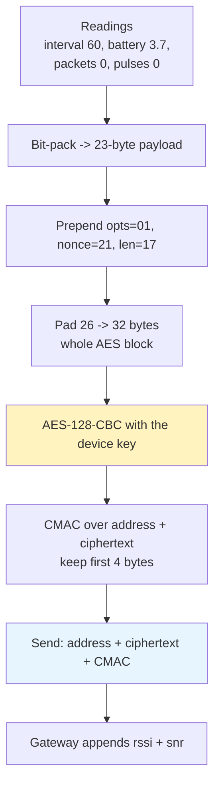

#### Part B - Rubix CE receives and takes it apart

**B1. The frame arrives.** From the log:

```text
msg="handleSerialPayload: enter, networkUUID=net_ad16a71b33f24360,
     dataHex=5CC0D947FC524A515FD4227327F6588AA1416DB7F061131F4EC1DE66F6E59AADE0382D4FAD19352F6F05"
```

84 hex characters = **42 bytes**.

**B2. Split it, working from both ends inwards.** The address is always the
first 4 bytes; the last 6 are always CMAC (4) plus rssi/snr (2).

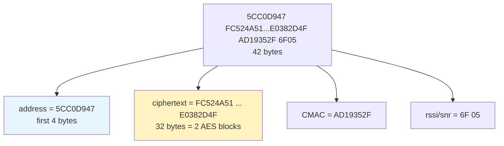

| Field | Value |
|---|---|
| address | `5CC0D947` |
| ciphertext | `FC524A515FD4227327F6588AA1416DB7F061131F4EC1DE66F6E59AADE0382D4F` |
| CMAC | `AD19352F` |
| rssi, snr | `6F`, `05` |

Sanity check: 32 bytes of ciphertext is a multiple of 16. Good.

**B3. Read the address and signal quality - no key needed.** The log line
confirms both:

```text
msg="dispatchFrame: decoded address=5CC0D947"
msg="dispatchFrame: address=5CC0D947 rssi=-111 snr=1.25 legacyDevice=false"
```

- **address `5CC0D947`** - second byte `C0` as always, so `5C`, `D9`, `47` are
  the identity bits
- **rssi `0x6F` = 111, negated = -111 dBm**
- **snr `0x05` = 5, divided by 4 = 1.25 dB**

This is the step that makes per-device keys work: CE knows *which* device sent
the frame before it needs any key at all.

**B4. Look up the device, fetch its key, decrypt.**

```bash
python3 - <<'PYEOF'
from cryptography.hazmat.primitives.ciphers import Cipher, algorithms, modes

FRAME = "5CC0D947FC524A515FD4227327F6588AA1416DB7F061131F4EC1DE66F6E59AADE0382D4FAD19352F6F05"
KEY   = "0301021604050F07E6095A0B0C12630F"   # this device's key, plain (no dashes)

f  = bytes.fromhex(FRAME)
ct = f[4:-6]                                  # drop address (4) and cmac+rssi+snr (6)

d  = Cipher(algorithms.AES(bytes.fromhex(KEY)), modes.CBC(b"\x00" * 16)).decryptor()
pt = d.update(ct) + d.finalize()

print("plaintext:", pt.hex().upper())
print("opts =", pt[0], " nonce =", pt[1], " len =", pt[2])
print("payload  :", pt[3:3 + pt[2]].hex().upper())
PYEOF
```

```text
plaintext: 01211701A08000F284C968A200000000A5900000000000000000324D468C5AEB
opts = 1  nonce = 33  len = 23
payload  : 01A08000F284C968A200000000A5900000000000000000
```

Compare with Part A: `opts=01`, `nonce=21` hex = 33, `len=17` hex = 23, and the
same 23-byte payload the device packed. The frame has been recovered exactly.

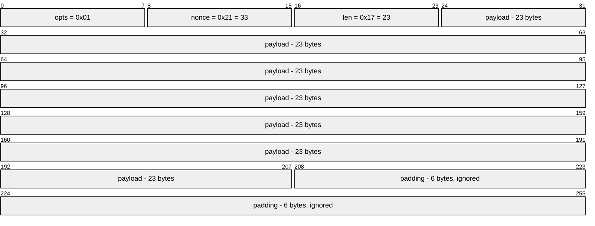

> The 6 padding bytes here are `324D468C5AEB`, not zeros. That is fine and
> expected - whatever happened to be in the buffer gets encrypted along with the
> data, and `len` is what marks where the real payload ends.

The module logs the same conclusion:

```text
msg="dispatchFrame: LoRaRAW decrypt ok (CMAC valid) address=5CC0D947 decodedLen=40"
```

**B5. Decode the payload into datapoints.** The codec unpacks the 23 bytes back
into the four values the device measured, and publishes them:

```text
msg="mqtt: publishing decoded values ... address=5CC0D947 points=6"
payload={"device_address_uuid":"5CC0D947","device_name":"5CC0D947",
         "payload":{"UVP-1":60,"UVP-2":3.700000047683716,"UVP-3":0,
                    "UVP-6":0,"rssi":-111,"snr":1.25}}
```

Round trip complete - these are the same readings from step A1:

| Point | Value received | Value sent (A1) |
|---|---|---|
| UVP-1 | 60 | transmit interval, 60 s |
| UVP-2 | 3.7000000476837 | battery, 3.7 V (float rounding) |
| UVP-3 | 0 | packet counter |
| UVP-6 | 0 | optical pulses |
| rssi | -111 | added by the gateway |
| snr | 1.25 | added by the gateway |

**B6. Cross-check against the republished frame.** The module also publishes the
decrypted frame on MQTT, which is a free way to confirm your own decryption:

```text
msg="mqtt: publishing topic=module-core-loraraw/raw bytes=64
     payload=5CC0D94701211701A08000F284C968A200000000A59000000000000000006F05"
```

Line that up against what we decrypted:

```text
5CC0D947  01 21 17  01A08000F284C968A200000000A5900000000000000000  6F05
address   opts      payload (23 bytes)                              rssi
          nonce                                                     snr
          len
```

Identical. If your manual decryption produces this, the key is right.

#### What a wrong key looks like

Run the same script with a different key and you get:

```text
plaintext: 3B95412ED51B8D9C30253231FF16EF63CB0246200F065D17A5A3CC96FD242618
opts = 59  nonce = 149  len = 65   -> nonsense
```

`opts` must be 0-4 and `len` cannot exceed the block, so both are out of range.
In the real module the CMAC check rejects the frame before it ever gets this
far, and the log shows the frame being dropped instead of decoded.

**This is the practical technique for finding out which key a silent device is
really using:** capture one frame, try the key you expect and the shared default
key, and see which one yields a sane `opts` and `len`.

> Note on the log lines `failed to find point with address_uuid ... io_number:
> UVP-1`: those are unrelated to encryption. Decryption already succeeded - the
> module is simply creating points that did not exist yet on first contact.
---

## 3. How Rubix CE picks the key

One field decides everything: **Device Key** in the device form.

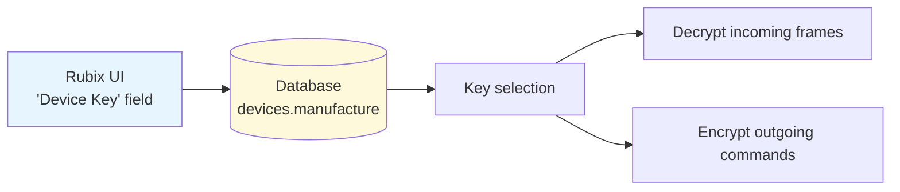

The rule, in plain terms:

- **Device Key filled in** - that key is used for this device, both directions.
- **Device Key empty** - the shared default key is used.

Filling the field is the only thing needed on the CE side. There is no separate
"enable encryption" switch, and no restart required.

---

## 4. Key format - the one thing people get wrong

A key is 16 bytes, written as 32 hex characters. **The two device families want
that written differently, and one will reject the other's format.**

| Where | Format | Example |
|---|---|---|
| Optical Power Meter (STM32) | plain AES key (without dashes) | `A3F91C77E2B4085D6619CC30FA47D2E8` |
| Droplet V2 (STM32) | plain AES key (without dashes) | `A3F91C77E2B4085D6619CC30FA47D2E8` |
| FGA Gen2 (ESP32) | **dashed AES key** | `A3-F9-1C-77-E2-B4-08-5D-66-19-CC-30-FA-47-D2-E8` |
| Rubix CE "Device Key" field | plain AES key (without dashes) | `A3F91C77E2B4085D6619CC30FA47D2E8` |

It is the **same key** in every row - only the way it is typed differs.

If you send a plain AES key (without dashes) to an FGA Gen2 you get:

```
E Srvc_Param: Data length of param 0x0220 (11 bytes) is NOT within the allowed range
```

The console counts bytes assuming dashes are present, so 32 plain characters are
misread as 11 bytes and rejected.

**Converting between the two:**

```bash
KEY=A3F91C77E2B4085D6619CC30FA47D2E8

# plain AES key (without dashes)  ->  dashed AES key, for FGA Gen2
echo "$KEY" | sed 's/../&-/g;s/-$//'
# A3-F9-1C-77-E2-B4-08-5D-66-19-CC-30-FA-47-D2-E8

# dashed AES key  ->  plain AES key (without dashes), for STM32 and the Rubix UI
echo "A3-F9-1C-77-E2-B4-08-5D-66-19-CC-30-FA-47-D2-E8" | tr -d '-'
# A3F91C77E2B4085D6619CC30FA47D2E8
```

---

## 5. Generating a key

Use a random generator. Do not invent keys by hand, do not use a pattern, and do
not reuse one key across devices.

```bash
python3 -c "import secrets; print(secrets.token_bytes(16).hex().upper())"
```

Record the key against the device's address (its 8-character ID) before moving
on. You will need it again when entering it in Rubix CE, and if the record is
lost the device must be re-keyed from scratch.

Suggested record format:

```text
address   | key                              | date       | operator
5CC0D947  | A3F91C77E2B4085D6619CC30FA47D2E8 | 2026-08-26 | <name>
```

### 5.1 The whole procedure at a glance

Before the per-device detail in sections 6 to 9, here is the entire flow in one
picture. The branch in the middle is the only part that differs between device
families.

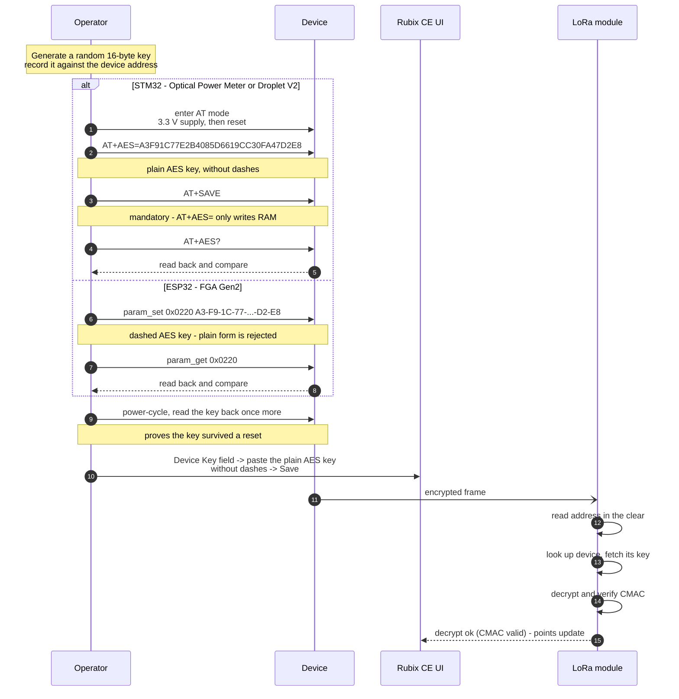

Two things to take from this diagram:

- **The device and Rubix CE are updated separately.** Between the AT commands
  and saving the Device Key field, the device is unreachable. That gap is
  expected - close it promptly rather than leaving a unit half-configured.
- **The read-back steps are not optional.** They are the only way to tell a
  write that took from one that silently did not.

---

## 6. Loading a key: Optical Power Meter (STM32)

### 6.1 Bench setup and wiring

You need two links to the board at the same time:

| Link | Used for | Hardware |
|---|---|---|
| SWD | flashing firmware, reading flash to verify | **ST-LINK V3** |
| UART | AT commands, boot log | **UART adapter**, 115200 baud, 8N1 |

An **ICQMCU adapter module** exposes both the ST-LINK port and the UART port at
once, so you do not have to unplug one to use the other. That matters here
because the normal sequence is: flash over SWD, then immediately talk AT over
UART, then read flash back over SWD to confirm.

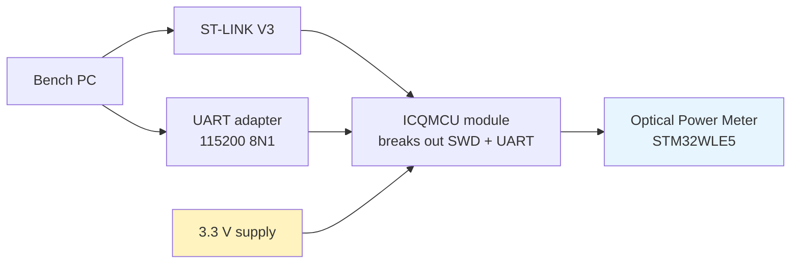

> **Power the board from a 3.3 V supply, not from its battery.** The reason is
> in 6.2 - on battery the board will refuse to enter AT mode.

### 6.2 Enter AT command mode

The firmware only checks for AT mode **once, at startup**, and only enters it
when the supply rail reads **above 2900 mV**
(`if (vref > 2900 && !vout_sel)` in `Core/Src/main.cpp`).

A battery-powered board reads around **1930 mV**, which is below that threshold,
so **AT commands are ignored no matter what you type**. This is the single most
common reason "the AT commands do nothing".

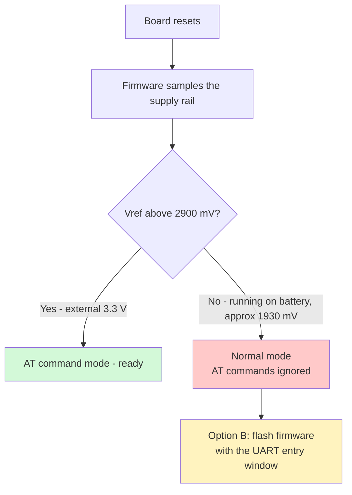

There are two ways to get in. Pick one.

#### Option A - power the board at 3.3 V (recommended for production)

Feed the board from a **3.3 V bench supply** through the ICQMCU module instead
of the battery, then reset it. Nothing needs to be flashed, and the shipping
firmware is used unchanged. This is the intended production path.

#### Option B - flash firmware that can enter AT mode on battery

If the board must stay on battery - for example a unit already assembled that
you do not want to open up - flash the firmware from the
`feat/debug-print-aes-key` branch of the `optical-power-meter` repository
(commit `aeb725a`, *"allow entering AT mode over UART on battery power"*).

That build adds a **3-second window after reset** during which any character on
UART enters AT mode, whatever the supply voltage reads. The 3.3 V check is still
tried first, so the production path in Option A is unaffected.

To use it: reset the board, then send characters continuously for a few seconds.
A single keypress is easily missed, because the firmware reads one character at
a time. Holding Enter down, or letting a script send `\r` every 50 ms, both work.

> Option B is bench tooling. Ship devices with the standard firmware.

### 6.3 Confirm you are in AT mode

```
AT+VER?
+VER: 0.0.1
```

No reply means you are not in AT mode:

- On Option A - check the board is on 3.3 V, not battery, and reset again.
- On Option B - reset and send characters faster, or for longer.

### 6.4 Read the current key (optional, useful for records)

```
AT+AES?
+AES: 0301021604050F07E6095A0B0C12630F
```

That value is the shared default key. Anything else means the device already has
its own key.

### 6.5 Write the new key

```
AT+AES=A3F91C77E2B4085D6619CC30FA47D2E8
+AES: OK

AT+SAVE
+SAVE: OK
```

Two rules that cause most failures:

> **`AT+SAVE` is mandatory.** `AT+AES=` only writes RAM. Without `AT+SAVE` the
> key is lost at the next reset and the device silently returns to its old key.

> **Type or send the command slowly.** The firmware reads one character at a
> time. If a script sends the 32-character key as one burst, characters are lost
> and you see a truncated reply such as `+AE OK`. Around 20-25 ms per character
> is reliable. Typing by hand is always slow enough.

The serial port may briefly disconnect during `AT+SAVE` while the chip writes
flash. That is normal.

### 6.6 Read it back

```
AT+AES?
+AES: A3F91C77E2B4085D6619CC30FA47D2E8
```

Must match exactly what you intended to load. If it does not, repeat 6.5 more
slowly.

---

## 7. Loading a key: Droplet V2 (STM32)

Droplet V2 uses the same chip family (STM32WLE5) and the same AT command set as
the Optical Power Meter. **Follow section 6 exactly** - same wiring (ST-LINK V3 +
UART through an ICQMCU module), same 3.3 V supply requirement to reach AT mode,
same commands, same plain AES key (without dashes), same mandatory `AT+SAVE`.

Quick reference:

```
AT+VER?                                          confirm AT mode
AT+AES?                                          read current key
AT+AES=A3F91C77E2B4085D6619CC30FA47D2E8          write new key (plain, no dashes)
AT+SAVE                                          persist to flash - REQUIRED
AT+AES?                                          read back and compare
```

---

## 8. Loading a key: FGA Gen2 (ESP32)

**Wiring:** a single USB cable, 115200 baud. The ESP32-C3 exposes a USB serial
port directly, so no ST-LINK, no UART adapter and no ICQMCU module are needed.

Easier than the STM32 boards in one way: **the console is always available.**
There is no AT mode to enter, and no 3.3 V supply requirement - it works on
battery.

Harder in another: **the key must be the dashed form.**

### 8.1 Read the current key

```
FGA-UART> param_get 0x0220
+ Data type : blob (16 bytes)
+ Value     : 03-01-02-16-04-05-0F-07-E6-09-5A-0B-0C-12-63-0F
```

Note the console prints the **dashed AES key**. That is also how it must be
entered here.

### 8.2 Write the new key

```
FGA-UART> param_set 0x0220 A3-F9-1C-77-E2-B4-08-5D-66-19-CC-30-FA-47-D2-E8
```

The parameter is stored immediately - there is no separate save command.

### 8.3 Read it back

```
FGA-UART> param_get 0x0220
+ Value : A3-F9-1C-77-E2-B4-08-5D-66-19-CC-30-FA-47-D2-E8
```

> **Remember:** when you type this same key into Rubix CE later, **remove the
> dashes**.

---

## 9. Entering the key in Rubix CE

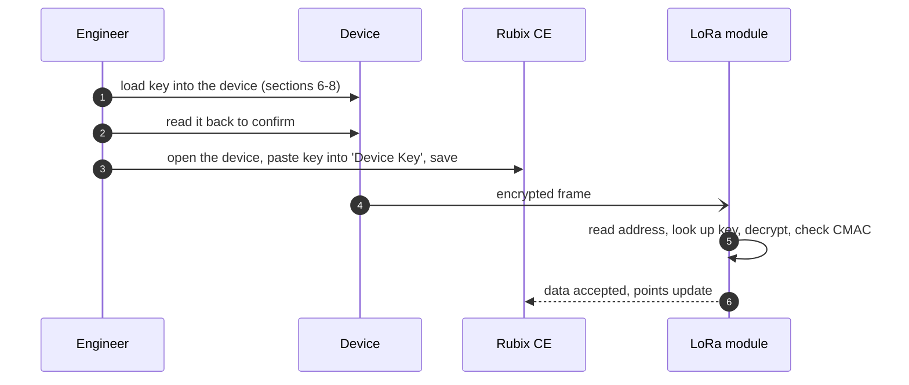

Steps:

1. Open Rubix CE, find the device by its address (for example `5CC0D947`).
2. Edit the device. The form has a **Device Key** field.
3. Paste the **plain AES key (without dashes)** - 32 characters.
4. Save.

The change takes effect on the next frame the device sends. No restart needed.

> If the device is an FGA Gen2 and you copied the key from `param_get`, strip
> the dashes first - see section 4.

---

## 10. Verifying it worked

Do not assume it worked because no error appeared. Wait for the device to send
its next frame, then check the log:

```bash
ssh <board> 'journalctl -u nubeio-rubix-os.service -f -g "5CC0D947"'
```

Replace `5CC0D947` with the device's address.

| What you see | What it means |
|---|---|
| `dispatchFrame: LoRaRAW decrypt ok (CMAC valid) address=...` | **Success.** Both ends agree on the key |
| `frame not decryptable and not accepted as plaintext ... incorrect CMAC or Key` | **Keys differ.** See troubleshooting |
| Nothing at all for that address | The device is not transmitting - check power, antenna, range |

Devices send on their own schedule. An Optical Power Meter typically transmits
every 60 seconds by default; allow a couple of minutes before concluding
anything.

---

## 11. Troubleshooting

### Device went silent right after re-keying

Almost always the two ends do not match. Check in this order:

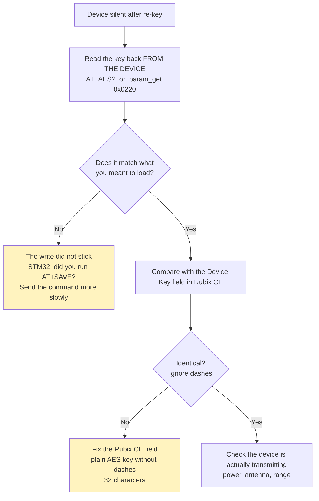

### `+AE OK` or a truncated reply on STM32

Characters were lost on the serial line. Send the command more slowly, around
20-25 ms per character. Then read back with `AT+AES?`.

### `Data length of param 0x0220 (11 bytes) is NOT within the allowed range`

You sent a plain AES key (without dashes) to an FGA Gen2. It needs the dashed
form - see section 4.

### Key reverts after a power cycle (STM32)

`AT+SAVE` was not run, or it failed. `AT+AES=` alone only writes RAM. Repeat the
write and the save, then power-cycle and read back to confirm it persisted.

### The device works but you are not sure the key really changed

Read it back from the device itself rather than trusting the write:

```
AT+AES?                     STM32
param_get 0x0220            ESP32
```

If it still shows `03-01-02-16-04-05-0F-07-E6-09-5A-0B-0C-12-63-0F`, that is the
shared default key and nothing changed.

---

## 12. Production checklist

Per device:

```text
[ ] 1. Generate a random key                    (section 5)
[ ] 2. Record address + key in the key register (section 5)
[ ] 3. Load the key into the device             (section 6, 7 or 8)
       - STM32: AT+AES= then AT+SAVE
       - ESP32: param_set 0x0220 with the dashed form
[ ] 4. Read the key back from the device and compare
[ ] 5. Power-cycle the device, read back again  (proves it persisted)
[ ] 6. Enter the key in Rubix CE Device Key     (plain, without dashes)
[ ] 7. Wait for a frame, confirm "decrypt ok (CMAC valid)"
[ ] 8. Tick the device off in the register
```

Rules that apply to every device:

- **Never reuse a key** across devices. One key per device, always.
- **Never use the shared default key** as a device key. It protects nothing.
- **Never skip the read-back.** A write that did not stick looks exactly like a
  write that did, until the device goes silent hours later.
- **Keep the key register safe.** Lose it and the affected devices must be
  re-keyed by hand.

---

## 13. Known limitations

Worth knowing before this is rolled out at scale.

| Limitation | What it means in practice |
|---|---|
| **Keys are stored unprotected on the device.** STM32 readout protection is not enabled, and the ESP32 has flash encryption and secure boot turned off | Someone with physical access and a debugger can read a device's key out of flash. Per-device keys still contain the damage to that one device |
| **Changing a key breaks the link until both ends are updated** | Plan the two steps together. A device is unreachable between step 3 and step 6 of the checklist |
| **STM32 boards cannot enter AT mode on battery** | Re-keying a deployed STM32 device means bringing it back to a jig, or opening the enclosure to power it externally |
| **A device that is factory-reset silently returns to the shared key** | Its address does not change, so Rubix CE keeps expecting the per-device key and the device goes quiet. Re-key it |
| **Nothing stops the same key being entered on two devices** | The system will not warn you. The key register and the checklist are the safeguard |
| **Legacy MicroEdge devices cannot have a per-device key** | They encrypt the whole frame including the address, so CE cannot tell which device sent it before decrypting. Recognisable by the second byte not being `C0` (for example `79ACDB45`). They stay on the shared key until replaced |

Two further notes for whoever owns the security posture, rather than for the
production line:

- The encryption uses a fixed all-zero initialisation vector, so identical
  payloads from the same device produce identical ciphertext. Per-device keys
  remove this pattern *between* devices but not within one device.
- There is no replay protection. A captured frame can be replayed and will be
  accepted as genuine.

Neither affects the procedure in this document, and neither is made worse by
per-device keys - they are pre-existing properties of the protocol.
