# Per-Device Key - Test Guideline (QA / QC)

**Who this is for:** a tester following the steps to give a LoRa device its own
AES key and confirm it works. Read top to bottom, do each step, tick each box.

**What "done" looks like:** the device's key matches the key in Rubix CE, and the
Rubix CE log shows `decrypt ok (CMAC valid)` for that device.

For the background - how AES protects a frame, why any of this works - see
[Per-Key-Loraraw.md](Per-Key-Loraraw.md). This file is the hands-on procedure.

---

## The job is two halves

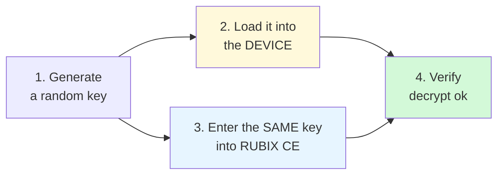

Both halves must use the **same key**. If they differ, the device goes silent.

Which device you have decides how you load the key:

| Device | Chip | How to load the key | Key format |
|---|---|---|---|
| Optical Power Meter | STM32 | AT commands over UART (needs 3.3 V) | plain, no dashes |
| Droplet V2 | STM32 | AT commands over UART (needs 3.3 V) | plain, no dashes |
| FGA Gen2 (UART) | ESP32 | console over USB | dashed |

---

## 0. What you need

**Hardware**

| Device | What to connect |
|---|---|
| Optical Power Meter / Droplet V2 (STM32) | ST-LINK V3MINIE + UART, both through a **2-in-1 ST-Link + UART module**, plus a **3.3 V wire** to enter AT mode |
| FGA Gen2 (ESP32) | a single **USB Type-C** cable |

**Software**

- A serial terminal at **115200 baud, 8N1** (any: `screen`, `minicom`, PuTTY, `pyserial`).
- `STM32_Programmer_CLI` - only if you want to verify the STM32 key over SWD.
- **Rubix CE** - download the binary from the releases page:
  <https://github.com/NubeIO/rubix-ce-builds/releases>

---

## 1. Generate a key

```bash
python3 -c "import secrets; print(secrets.token_bytes(16).hex().upper())"
```

Example output: `A3F91C77E2B4085D6619CC30FA47D2E8`

Write it down against the device address (its 8-character ID) before going on.

```text
address   | key                              | tester | date
5CC0D947  | A3F91C77E2B4085D6619CC30FA47D2E8 |        |
```

- [ ] Key generated and recorded

---

## 2A. Load the key: Optical Power Meter and Droplet V2 (STM32)

These two boards are the same procedure. Optical Power Meter is shown; Droplet V2
is identical.

### 2A.1 Wire it up

Connect the ST-LINK and the UART through the 2-in-1 module, and **feed 3.3 V into
the board** - that is what lets it enter AT mode.

**Optical Power Meter:**

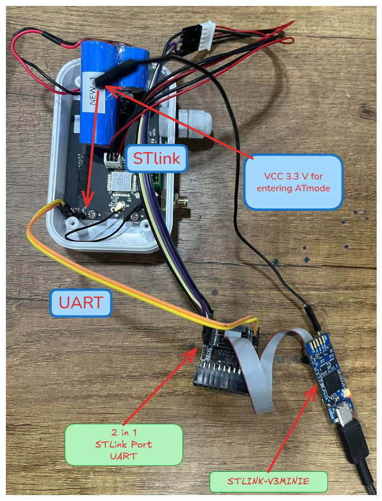

**Droplet V2** (same connections):

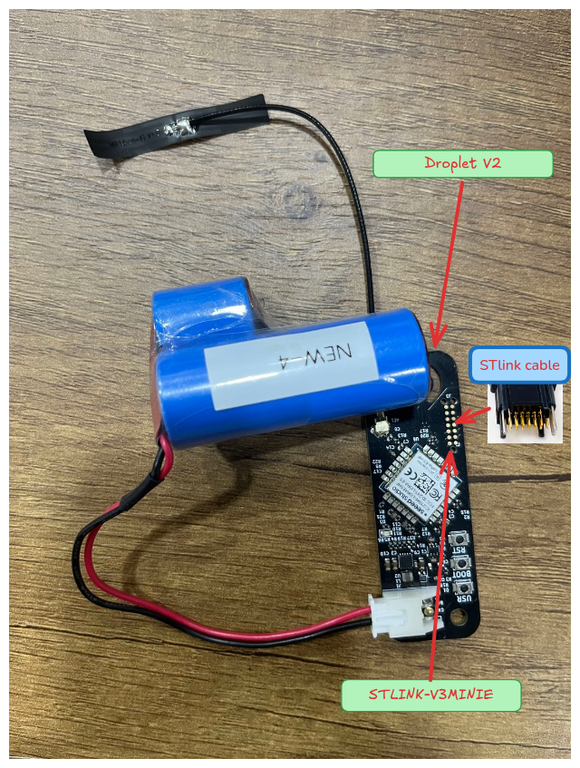

Key points from the photos:

- **VCC 3.3 V** wire into the board - required to enter AT mode.
- **ST-Link** to the SWD pads.
- **UART** to the 2-in-1 ST-Link + UART module.
- The module goes to the **STLINK-V3MINIE** on USB.

> Without the 3.3 V wire the board reads about 1.9 V and will **ignore all AT
> commands**. This is the number-one reason "AT does nothing".

- [ ] Wired, 3.3 V applied

### 2A.2 Enter AT mode and confirm

Open the serial terminal at 115200, reset the board, then:

```
AT+VER?
+VER: 0.0.1
```

A reply means you are in AT mode. No reply - check the 3.3 V wire and reset again.

- [ ] `AT+VER?` replies

### 2A.3 Read the current key (optional, for the record)

```
AT+AES?
+AES: 0301021604050F07E6095A0B0C12630F
```

That value is the shared default key - the device has not been personalised yet.

### 2A.4 Write the new key, then SAVE

Use the key from step 1, **plain hex, no dashes**:

```
AT+AES=A3F91C77E2B4085D6619CC30FA47D2E8
+AES: OK

AT+SAVE
+SAVE: OK
```

> **Two rules, or the key will not stick:**
>
> 1. **`AT+SAVE` is mandatory.** `AT+AES=` only writes RAM. Skip the save and the
>    key is gone at the next reset.
> 2. **Type/send slowly** - the parser reads one character at a time. Pasting the
>    whole key too fast drops characters (you see `+AE OK` instead of `+AES: OK`).
>    Typing by hand is always slow enough.

The port may drop for a moment during `AT+SAVE` while flash is written - normal.

- [ ] `+AES: OK` and `+SAVE: OK`

### 2A.5 Read it back

```
AT+AES?
+AES: A3F91C77E2B4085D6619CC30FA47D2E8
```

Must match step 1 exactly.

- [ ] Read-back matches

### 2A.6 (Optional) verify in flash over SWD

The surest check - reads the chip directly, bypassing the console:

```bash
STM32_Programmer_CLI -c port=SWD mode=UR -r 0x0803C000 0x2000 /tmp/cfg.bin
python3 - <<'EOF'
d = open('/tmp/cfg.bin','rb').read()
for i, base in enumerate([0, 0x800, 0x1000, 0x1800]):
    if int.from_bytes(d[base:base+4],'little') == 0xDEADBEEF:
        print("page%d key = %s" % (i, d[base+0x5C:base+0x5C+16].hex().upper()))
EOF
```

The **last** page that prints a key is the one in use - it must match step 1.

Skip to [section 3](#3-run-rubix-ce-and-enter-the-key).

---

## 2B. Load the key: FGA Gen2 (ESP32)

### 2B.1 Wire it up

Just a **USB Type-C** cable. No ST-Link, no separate 3.3 V, no AT mode - the
console is always available.

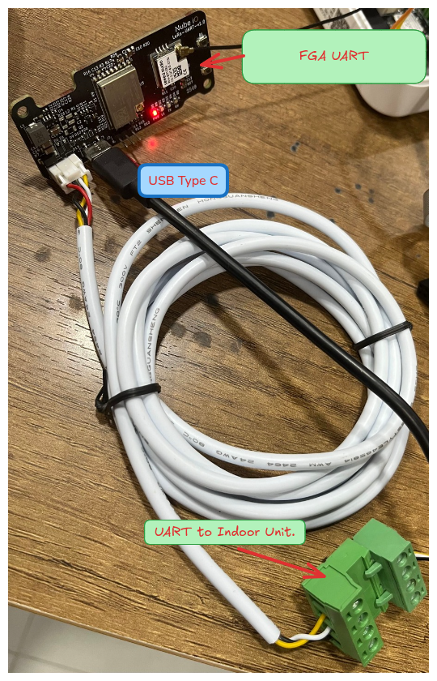

- The USB-C goes to the bench PC.
- The other cable is the UART to the indoor HVAC unit - leave it as-is.

- [ ] USB connected, console reachable at 115200

### 2B.2 Read the current key

```
FGA-UART> param_get 0x0220
+ Value : 03-01-02-16-04-05-0F-07-E6-09-5A-0B-0C-12-63-0F
```

Notice the console prints the key **with dashes**. That is also how you must
enter it.

### 2B.3 Write the new key - DASHED

Take the key from step 1 and add dashes between every byte:

```bash
echo "A3F91C77E2B4085D6619CC30FA47D2E8" | sed 's/../&-/g;s/-$//'
# A3-F9-1C-77-E2-B4-08-5D-66-19-CC-30-FA-47-D2-E8
```

Then:

```
FGA-UART> param_set 0x0220 A3-F9-1C-77-E2-B4-08-5D-66-19-CC-30-FA-47-D2-E8
```

> If you paste plain hex (no dashes) you get:
> `Data length of param 0x0220 (11 bytes) is NOT within the allowed range`.
> Add the dashes and try again. There is no separate save step.

- [ ] `param_set` accepted (no length error)

### 2B.4 Read it back

```
FGA-UART> param_get 0x0220
+ Value : A3-F9-1C-77-E2-B4-08-5D-66-19-CC-30-FA-47-D2-E8
```

Must match step 1 (ignoring dashes).

- [ ] Read-back matches

---

## 3. Run Rubix CE and enter the key

### 3.1 Get and run Rubix CE

Download the binary from <https://github.com/NubeIO/rubix-ce-builds/releases>,
then run it:

```bash
./Rubix\ CE
```

### 3.2 Go to the LoRaRAW device manager

Navigate: **Supervisor -> Location -> Group -> Host -> Drivers (Networks) ->
Loraraw (Network)**. The device list opens on the right.

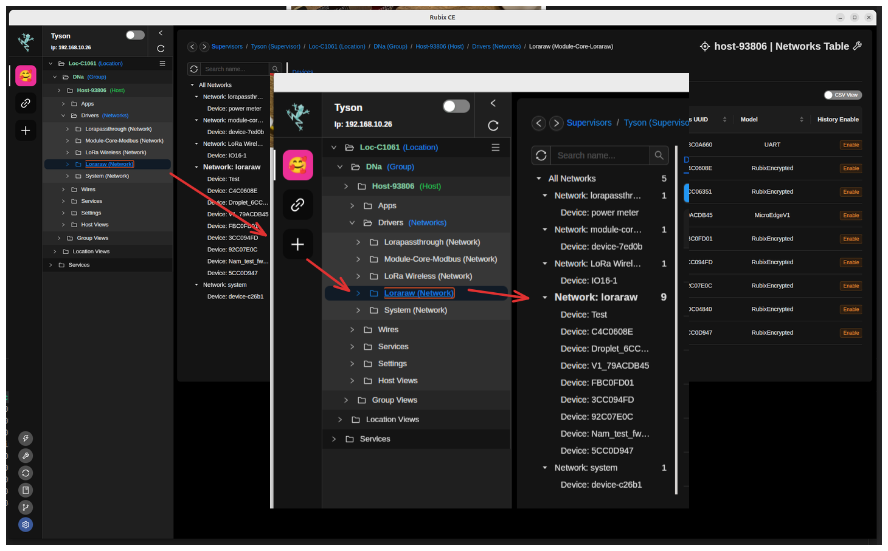

- [ ] LoRaRAW device list open

### 3.3 Read the Device Key column - shared vs per-device

The **Device Key** column tells you each device's state at a glance:

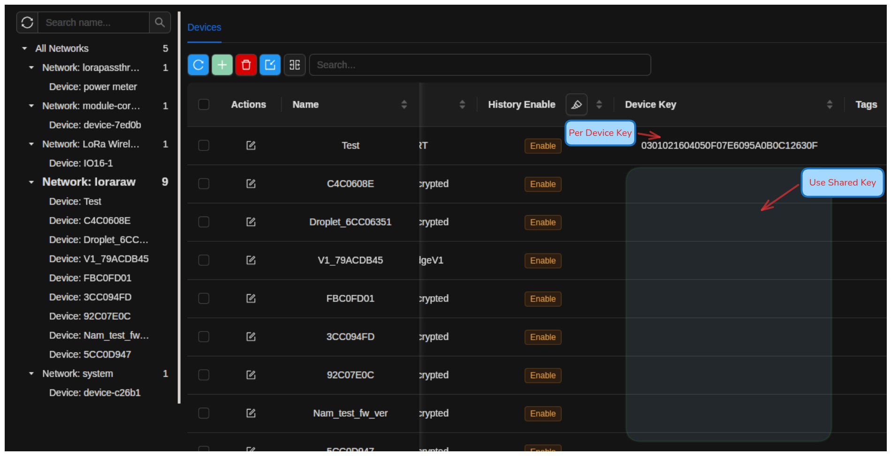

- **A key is shown** -> that device uses its **own per-device key**.
- **The cell is empty** -> that device uses the **shared default key**.

You can set the key when you add a device, or edit an existing one. Both are
below.

### 3.4 Enter the key when ADDING a device

Click the green **+** to add a device.

**Step 1 - pick the device type.** For anything other than the listed Droplets,
choose **More Options -> View More**:

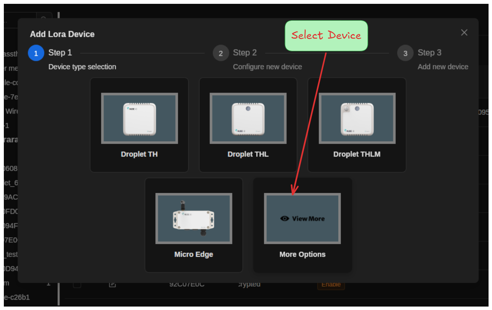

**Step 3 - fill the form:**

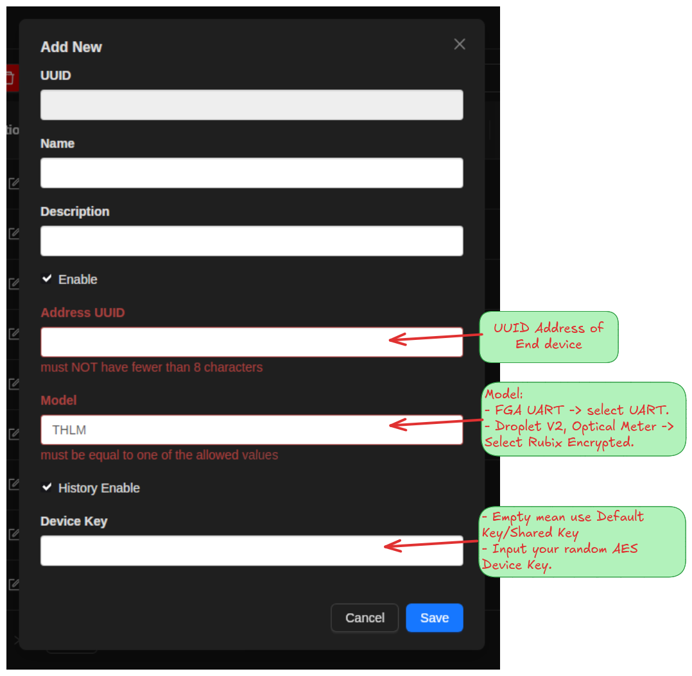

| Field | What to enter |
|---|---|
| **Name** | any label you like |
| **Address UUID** | the device's 8-character address (for example `5CC0D947`) - at least 8 characters |
| **Model** | **FGA Gen2 -> `UART`**. **Droplet V2 / Optical Power Meter -> `RubixEncrypted`** |
| **Device Key** | paste the key from step 1, **plain hex, no dashes**. Leave **empty** to keep using the shared key |

Click **Save**.

- [ ] Device added with the correct Model and Device Key

### 3.5 Enter the key when EDITING a device

Click the edit (pencil) icon on the device row. Set **Device Key**, then **Save**:

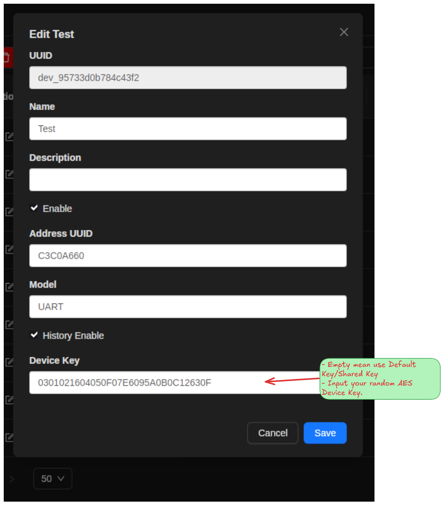

- **Device Key** field: paste the key (plain hex, no dashes), or clear it to fall
  back to the shared key.

> Reminder: even for an FGA Gen2, the Rubix CE field takes the **plain** key
> (no dashes). The dashes are only for the ESP32 console in step 2B.

- [ ] Device Key set and saved

### 3.6 Confirm the key landed

Back in the list, check the **Device Key** column for that device:

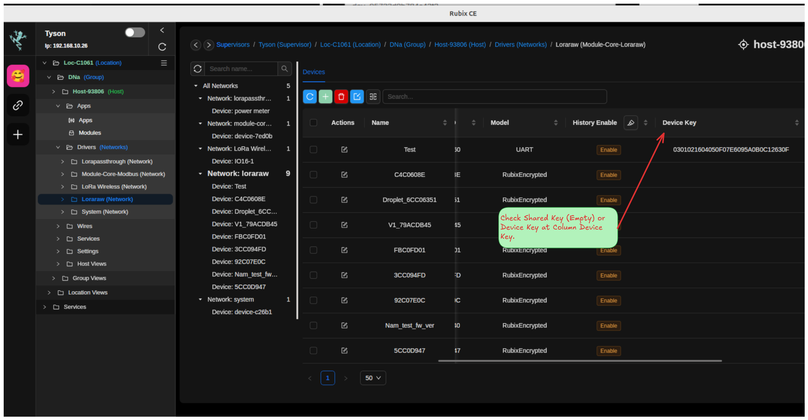

The key you entered should now show in the row (empty means shared key).

- [ ] Device Key column shows the expected value

---

## 4. Verify end to end

The real test: does Rubix CE decrypt the device's traffic with the key you set?

Wait for the device to transmit (an Optical Power Meter sends about every 60
seconds by default), then check the log:

```bash
ssh <board> 'journalctl -u nubeio-rubix-os.service -f -g "5CC0D947"'
```

Replace `5CC0D947` with your device address.

| Log line | Meaning |
|---|---|
| `LoRaRAW decrypt ok (CMAC valid) address=...` | **PASS** - both ends agree on the key |
| `frame not decryptable and not accepted as plaintext ... incorrect CMAC or Key` | **FAIL** - keys differ, see troubleshooting |
| nothing for that address | device is not transmitting - check power, antenna, range |

- [ ] Log shows `decrypt ok (CMAC valid)`

---

## 5. Troubleshooting

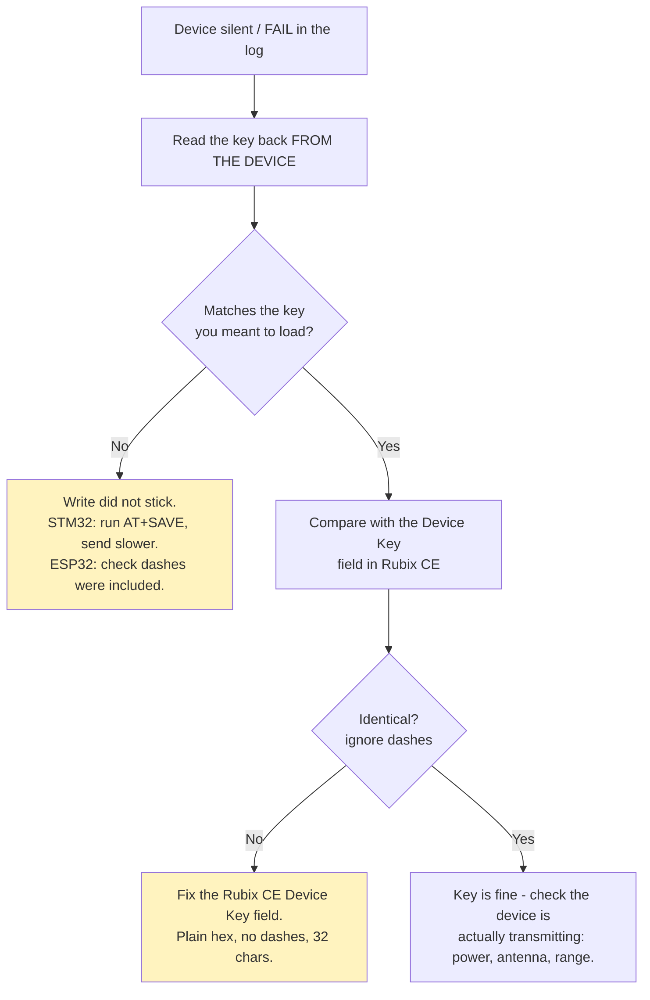

| Symptom | Cause | Fix |
|---|---|---|
| `AT+VER?` no reply (STM32) | not in AT mode | apply 3.3 V, reset |
| `+AE OK` / truncated reply (STM32) | characters dropped | send slower, ~20-25 ms per char |
| key reverts after power-cycle (STM32) | forgot `AT+SAVE` | write again, then `AT+SAVE`, then read back |
| `Data length ... 11 bytes ... NOT within range` (ESP32) | plain hex sent | add dashes: `AA-BB-CC-...` |
| Rubix CE shows `incorrect CMAC or Key` | keys differ | compare device read-back vs the Device Key field |
| device still shows the shared key `030102...630F` | key never changed | redo the load step |

---

## 6. QA sign-off checklist

Per device:

```text
[ ] 1. Random key generated and recorded against the address
[ ] 2. Key loaded into the device
       STM32: AT+AES= then AT+SAVE, plain hex
       ESP32: param_set 0x0220 with dashes
[ ] 3. Key read back FROM THE DEVICE and it matches
[ ] 4. Power-cycle the device, read back again (proves it persisted)
[ ] 5. Device added/edited in Rubix CE with correct Model + Device Key
[ ] 6. Rubix CE log shows decrypt ok (CMAC valid)
[ ] 7. Row ticked off in the key register
```

Rules that always apply:

- **One key per device.** Never reuse a key across devices.
- **Never enter the shared default key** as a Device Key - it protects nothing.
- **Always read back** from the device. A write that silently failed looks
  exactly like one that worked, until the device goes quiet later.
- **Keep the key register.** Lose it and the device must be re-keyed by hand.
